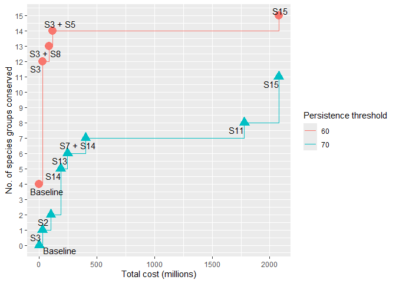
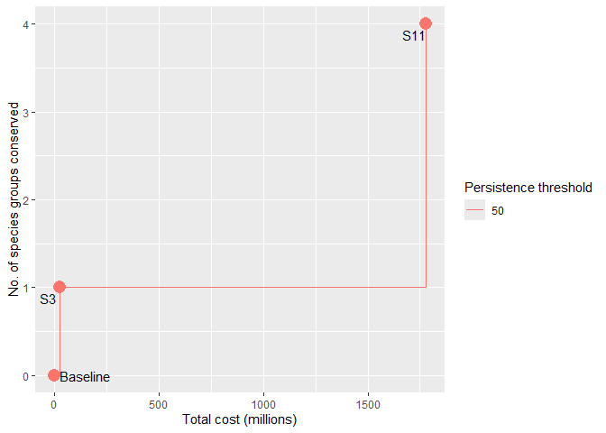
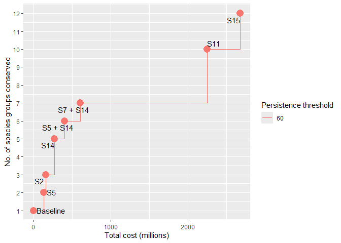
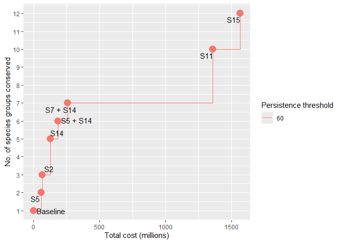

Complementarity Analysis
================
Abbey Camaclang and Aranya Iyer
2025-09-24

This code performs the complementarity analysis using the consOpt R
package developed by Nicolai Cryer <nkcryer@gmail.com> and updated by
Abbey Camaclang with a number of bug fixes. Note that this package is
still under development; we recommend checking the results manually. For
some sparse documentation, type `?Optimize`

To install, download/clone the most recent version of the package from
<https://github.com/ConservationDecisionsLab/consOpt.git>, open the
.RProj file in R Studio and use R Studio tools to build and install the
package.

You can also try installing from R using devtools, using the following
command: `devtools::install_github("ConservationDecisionsLab/consOpt")`

Requires the following .csv files as inputs

1.  **ExpPerform_all.csv**: estimates of expected performance (i.e.,
    probability of persistence)  
2.  **CostFeas.csv**: table of cost and feasibility for each strategy,
    and  
3.  **Combinations.csv**: table specifying the individual strategies
    that make up each combination strategies (should have a column for
    baseline and all individual and combination strategies.

``` r
library(Matrix)
library(consOpt)
library(tidyverse)
library(cowplot)
library(here)
library(dplyr)
library(ggplot2)

# Specify paths to subfolders within current working directory
input <- here("data", "raw") # where raw data files are located
results <- here("results") # where results of analysis should be saved
uncertainty <- here("results", "uncertainty") # results of uncertainty analyses

# Read in and prep data
combos <- read.csv(paste0(input, "/Combinations.csv"), header = TRUE) 

costfeas <- read.csv(paste0(input, "/CostFeas.csv")) 
costs <- costfeas[,str_which(names(costfeas), "3")] # PV Cost with 3% discount rate
names(costs) <- costfeas$Strategy

# Function to calculate annualized cost values
#' Calculates equivalent annual values given total present value costs. Based on formula from Chapter 6 of US EPA Guidelines for Preparing Economic Analyses, available from <https://www.epa.gov/environmental-economics/guidelines-preparing-economic-analyses-3rd-edition> 
#' 
#' @param pv vector of present values
#' @param disc discount rate used to derive present values
#' @param dur number of time periods (e.g. years) over which discounting was applied to derive present values
annualized <- function(pv, disc, dur) {
  num <- disc * ((1+disc)^dur)
  den <- ((1+disc)^dur) - 1
  out <- pv*(num/den)
}
```

## 1. Probability of persistence

``` r
exp.perf <- read.csv(paste0(results, "/ExpPerformance.csv"))  

perf.transposed <- exp.perf[,-1] %>%
  t() %>%
  data.frame() %>%
  setNames(exp.perf[,1]) %>%
  mutate(Est.type = rownames(.)) %>%
  separate(Est.type, c("Estimate", "Strategy"), sep = "[_]", remove = TRUE) %>%
  relocate(Estimate, Strategy) %>%
  remove_rownames()
```

### 1.1 Most likely (Best) estimates

Finds Pareto-optimal strategies that maximizes the number of species or
groups secured to a given threshold probability of persistence for the
least cost. Costs are in present values discounted at a rate of 3% per
year.

``` r
best <- perf.transposed %>%
  filter(grepl("Best", Estimate)) %>%
  mutate(Estimate = NULL) %>%
  column_to_rownames("Strategy")

best <- round(best, digits=0)

# write.csv(best, paste0(results, "/ExpPerform_best.csv"), row.names = FALSE)

results.best <- Optimize(benefits.matrix = best, 
                    cost.vector = costs, 
                    combo.strategies = combos
                    , thresholds = c(60.00)
                    )

optcurve.best <- PlotResults(results.best)

results.best$annual_cost <- annualized(results.best$total_cost, disc = 0.03, dur = 27)
                    
write.csv(results.best, paste0(results, "/Complementarity.csv"), row.names = FALSE)
```

<!-- -->

### 1.2 Uncertainty analysis

*Performance under different future scenarios*

Determine how Pareto-optimal strategies for most likely estimates
perform (i.e., number of species secured to threshold level) under the
most optimistic or most pessimistic scenarios (i.e. high or low
estimates).

``` r
# Load custom function
#' Takes the optimal strategies identified for a particular scenario (A) and determines the number of species groups secured to specified threshold under an alternative scenario (B)
#' @param scenario matrix of probability of persistence or benefit under the alternative scenario B
#' @param optresults output of `consOpt::Optimize()` for scenario A, modified to include `annual_cost` values
#' @param criteria threshold value to use in determining whether a species or group is secured or not
#' @param strategies character vector listing the strategies included in the analysis, including the Baseline
#' @param maxcombo maximum number of strategies included in a Pareto-optimal solution

countsec <- function(scenario, optresults, criteria, strategies, maxcombo){
  tmp.col <- LETTERS[seq(from = 1, to = maxcombo)]
  
  out <- optresults %>%
    mutate(threshold = criteria, number_of_species = 0) %>%
    separate(strategies, tmp.col, " [+] ", remove = FALSE)
  
  tmp.count <- scenario # to create a table with same dimensions
  tmp.count[,] <- ifelse(tmp.count >= criteria, 1, 0) # 1 if >=threshold, else 0
  tmp.count <- cbind(strategies, tmp.count)
  
  for (i in 1:nrow(out)) {
    if (is.na(out$B[i])) { # if there's only 1 strategy
      tmprow <- str_which(tmp.count$strategies, out$strategies[i]) 
      out$number_of_species[i] <- sum(tmp.count[tmprow,2:length(tmp.count)])
      } else {
        tmp <- list()
        for (j in 1:maxcombo) {
          colnum <- str_which(colnames(out), tmp.col[j])
          tmp[[j]] <- tmp.count[str_which(tmp.count$strategies, out[i,colnum]),] 
          } #end for j
        tmp.all <- do.call(rbind.data.frame, tmp) %>%
          pivot_longer(!strategies, names_to = "species_groups", values_to = "secured") %>%
          pivot_wider(names_from = strategies, values_from = "secured")
        tmp.all$count <- ifelse(apply(tmp.all[,2:ncol(tmp.all)], 1, function (x) any(x==1)), 1,0)
        out$number_of_species[i] <- sum(tmp.all$count)  
      } # end else
  } # end for i
  
  out <- out %>%
    select(-any_of(tmp.col))
  
  } # end function
```

``` r
# Find max number of strategies in a Pareto-optimal solution for most likely estimates (best guess)
maxstrat <- max(lengths(str_split(results.best$strategies, " [+] "))) 

# Most optimistic scenario
high <- perf.transposed %>%
  filter(grepl("High", Estimate)) %>%
  mutate(Estimate = NULL) %>%
  column_to_rownames("Strategy")
high <- round(high, digits = 0)

# write.csv(high, paste0(uncertainty, "/ExpPerform_high.csv"), row.names = FALSE) 

opt.high60 <- countsec(high, results.best, criteria = 60, strategies = costfeas$Strategy, maxcombo = maxstrat) 
opt.high70 <- countsec(high, results.best, criteria = 70, strategies = costfeas$Strategy, maxcombo = maxstrat)
opt.high <- bind_rows(opt.high60, opt.high70)

write.csv(opt.high, paste0(uncertainty, "/Uncertainty_highPOP.csv"), row.names = FALSE)

# Most pessimistic scenario
low <- perf.transposed %>%
  filter(grepl("Low", Estimate)) %>%
  mutate(Estimate = NULL) %>%
  column_to_rownames("Strategy")
low <- round(low, digits = 0)

# write.csv(low, paste0(uncertainty, "/ExpPerform_low.csv"), row.names = FALSE) 

opt.low <- countsec(low, results.best, criteria = 50, strategies = costfeas$Strategy, maxcombo = 2)

write.csv(opt.low, paste0(uncertainty, "/Uncertainty_lowPOP.csv"), row.names = FALSE)
```

*Optimal strategies for most pessimistic and optimistic scenarios*

Find Pareto-optimal strategies based on most pessimistic (low) and most
optimistic (high) estimates of probability of persistence

``` r
# Most optimistic estimates
results.high <- Optimize(benefits.matrix = high,
                  cost.vector = costs,
                  combo.strategies = combos
                  , thresholds = c(60.00, 70.00)
                  ) 

optcurve.high <- PlotResults(results.high)

results.high$annual_cost <- annualized(results.high$total_cost, disc = 0.03, dur = 27)

write.csv(results.high, paste0(uncertainty, "/Complementarity_highPOP.csv"), row.names = FALSE)
```

<!-- -->

``` r
# Most pessimistic estimates
results.low <- Optimize(benefits.matrix = low,
                  cost.vector = costs,
                  combo.strategies = combos
                  , thresholds = c(50.00)
                  )
optcurve.low <- PlotResults(results.low) 

results.low$annual_cost <- annualized(results.low$total_cost, disc = 0.03, dur = 27)

write.csv(results.low, paste0(uncertainty, "/Complementarity_lowPOP.csv"), row.names = FALSE)
```

<!-- -->

*Optimal strategies for different discounting rates*

Finds Pareto-optimal strategies based on the most likely (Best)
estimates of probabilities of persistence, using present value costs
with 0% and 7% discount rates.

``` r
# Discount rate 0%
costs <- costfeas[,str_which(names(costfeas), "0")] # PV Cost with 0% discount rate

results.0disc <- Optimize(benefits.matrix = best, 
                    cost.vector = costs, 
                    combo.strategies = combos
                    , thresholds = c(60.00) 
                    )

optcurve.0disc <- PlotResults(results.0disc)

results.0disc$annual_cost <- results.0disc$total_cost/27

write.csv(results.0disc, paste0(uncertainty, "/Complementarity_0disc.csv"), row.names = FALSE)
```

<!-- -->

``` r
# Discount rate 7%
costs <- costfeas[,str_which(names(costfeas), "7")] # PV Cost with 7% discount rate

results.7disc <- Optimize(benefits.matrix = best, 
                    cost.vector = costs, 
                    combo.strategies = combos
                    , thresholds = c(60.00) 
                    )

optcurve.7disc <- PlotResults(results.7disc)

results.7disc$annual_cost <- annualized(results.7disc$total_cost, disc = 0.07, dur = 27 )

write.csv(results.7disc, paste0(uncertainty, "/Complementarity_7disc.csv"), row.names = FALSE)
```

<!-- -->

## 2. Benefit estimates

Finds Pareto-optimal strategies based on most likely (Best) estimates of
Benefit, where  
Benefit = % persistence with Strategy - % persistence under Baseline.

``` r
library(Matrix)
library(consOpt)
library(tidyverse)
library(cowplot)
library(here)
library(dplyr)
library(ggplot2)

# Specify paths to subfolders within current working directory
input <- here("data", "raw") # where raw data files are located
derived <- here("data") # where compiled/summarized data are located
results <- here("results") # where results of analysis should be saved
figures <- here("figures") # where plots should be saved

# Read in and prep data
combos <- read.csv(paste0(input, "/Combinations.csv"), header = TRUE) 

costfeas <- read.csv(paste0(input, "/CostFeas.csv")) 
costs <- costfeas[,str_which(names(costfeas), "3")] # PV Cost with 3% discount rate
names(costs) <- costfeas$Strategy

exp.ben <- read.csv(paste0(results, "/ExpBenefits.csv")) # expected benefit estimates

# Add baseline values of zero here
exp.ben$Wt.Best_Baseline <- 0 
exp.ben$Wt.Low_Baseline <- 0 
exp.ben$Wt.High_Baseline <- 0 
exp.ben <- exp.ben %>%
  select(Ecological.Group,Wt.Best_Baseline,Wt.Low_Baseline, Wt.High_Baseline, everything()) # re-ordering columns

ben.transposed <- exp.ben[,-1] %>%
  t() %>%
  data.frame() %>%
  setNames(exp.ben[,1]) %>%
  mutate(Est.type = rownames(.)) %>%
  separate(Est.type, c("Estimate", "Strategy"), sep = "[_]", remove = TRUE) %>%
  relocate(Estimate, Strategy) %>%
  remove_rownames()

best.ben <- ben.transposed %>%
  filter(grepl("Best", Estimate)) %>%
  mutate(Estimate = NULL) %>%
  column_to_rownames("Strategy")

best.ben <- round(best.ben, digits=0)

# write.csv(best.ben, paste0(results, "/ExpBenefits_best.csv"), row.names = FALSE) 

results.bestben <- Optimize(benefits.matrix = best.ben, 
                    cost.vector = costs, 
                    combo.strategies = combos
                    , thresholds = c(15.00) 
                    )

optcurve.bestben <- PlotResults(results.bestben) + 
  labs(y = "Number of species groups",
       color = "Benefit threshold") # overrides the axis label and legend title
```

``` r
results.bestben$annual_cost <- annualized(results.bestben$total_cost, disc = 0.03, dur = 27)

write.csv(results.bestben, paste0(results, "/Complementarity_Benefits.csv"), row.names = FALSE)
```

<!-- -->
