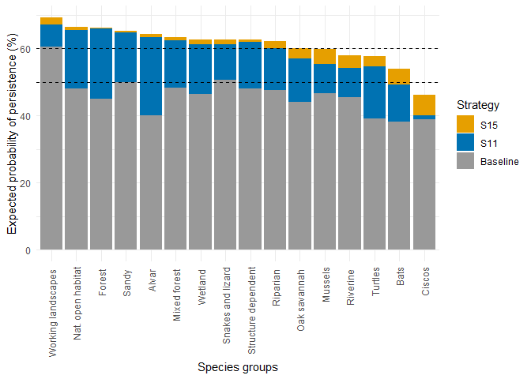
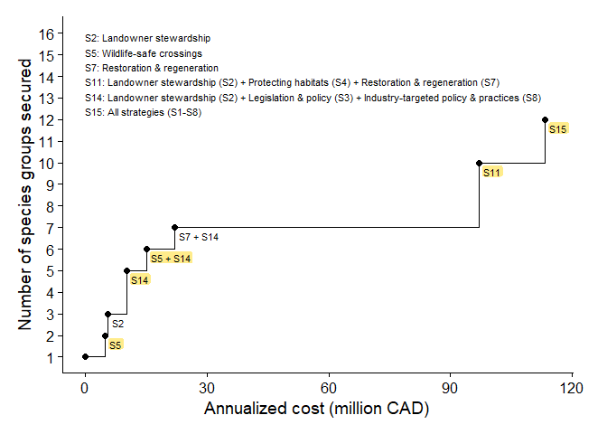
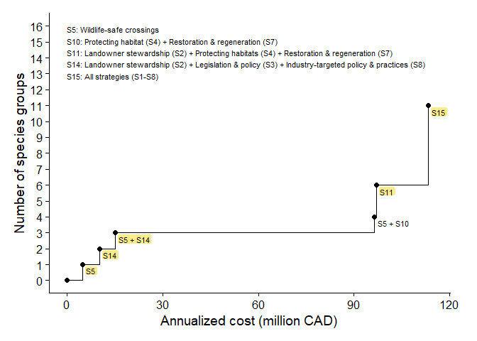
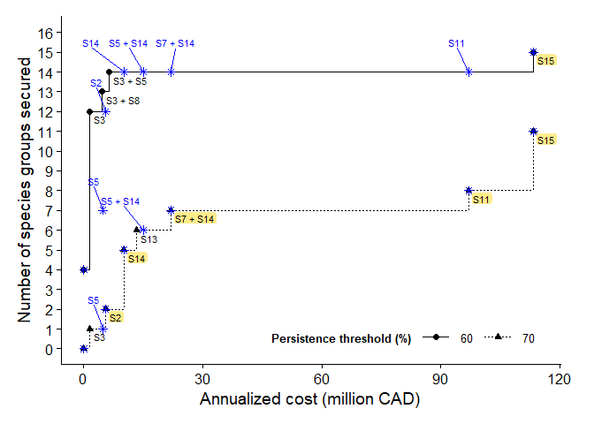
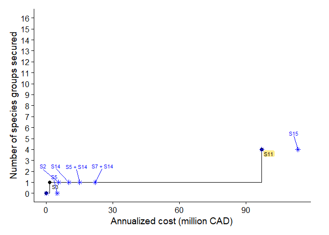
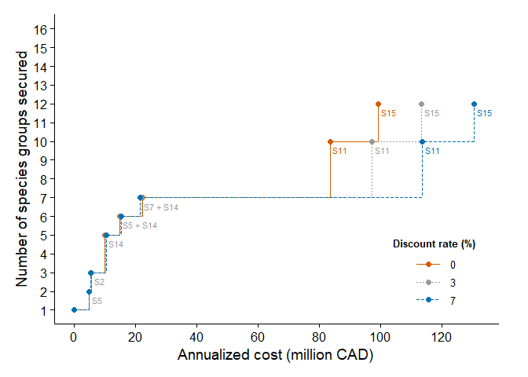

Manuscript plots
================
Abbey Camaclang and Aranya Iyer
2025-09-24

Reproduces plots used in the published manuscript

``` r
library(Matrix)
library(tidyverse)
library(cowplot)
library(here)
library(dplyr)
library(ggplot2)
library(ggrepel)
library(gridExtra)

# Specify paths to subfolders within current working directory
results <- here("results") # where results of analysis should be saved
uncertainty <- here("results", "uncertainty") # results of uncertainty analyses
figures <- here("figures") # where plots should be saved

numspp <- 16 # total number of species groups in the analysis
```

**Plotting function**

Plots Pareto frontier curves based on results of complementarity
analysis

``` r
#' Custom function for plotting Pareto frontier curves showing the number of species or groups secured to the given threshold (y-axis) by Pareto-optimal strategies against their estimated annual cost in millions of dollars (x-axis)
#' 
#' @param summary.results output of `consOpt::Optimize()`, modified to include `annual_cost` values and a `highlight` column indicating which data points should be highlighted (1) or not (0) in the plot. 
#' @param ymax upper y-axis limit
#' @param leg.title a character value specifying the legend title to use
#' @param draw.labels a logical value indicating whether to add data point labels
PlotOptCurve <- function(summary.results, ymax, leg.title, draw.labels=TRUE){
  
  tmp <- summary.results
  
  tmp$annual_cost <- (tmp$annual_cost / 10^6) # rescale x-axis to millions
  tmp$threshold <- round(tmp$threshold)
  
  # Create plot object
  this.plot <- ggplot(tmp, aes(
    x = annual_cost, 
    y = number_of_species
    , group = threshold
    , linetype = factor(threshold)
    , shape = factor(threshold)
    , label = ifelse(strategies=="Baseline",NA,strategies)
    )
    ) +
    geom_step() +
    geom_point(size = 2) +
    theme_cowplot() +
    theme(legend.justification = c(1,0)
          , legend.position = if(length(unique(tmp$threshold))==1){"none"} else {c(0.95,0.05)}
          , legend.key.height = unit(0.6,"cm")
          , legend.key.width = unit(1, "cm")
          , legend.title = element_text(size = 10, face = "bold")
          , legend.text = element_text(size = 10)
          , plot.margin = margin(0.5, 1, 0.5, 0.5, "cm") 
          , legend.direction = "horizontal"
          ) + 
    scale_fill_manual(aesthetics = c("fill"), values = cols) +
    scale_y_continuous(
      breaks = min(tmp$number_of_species):ymax,
      limits = c(min(tmp$number_of_species), ymax)
      ) +
    labs(x = "Annualized cost (million CAD)", 
         y = "Number of species groups secured"
         , linetype = leg.title 
         , shape = leg.title 
         ) +
    coord_cartesian(clip = "off")
  
  # Adjust label positions
  if(draw.labels){
    this.plot <- this.plot + 
      geom_label_repel(aes(fill = factor(highlight)), size = 3
                      , hjust = "left"
                      , nudge_x = 1.1
                      , nudge_y = -0.4
                      , show.legend = FALSE
                      , label.padding = 0.1
                      , label.size = NA
                      , box.padding = 0
                      , min.segment.length = 5
                      )
    }
  
  plot(this.plot)
  this.plot
}
```

## Main manuscript figures

### Figure 2

``` r
exp.perf <- read.csv(paste0(results, "/ExpPerformance.csv"), header = TRUE) 

# Shorten the name of some species groups
exp.perf$Ecological.Group <- gsub("species", "", exp.perf$Ecological.Group)
exp.perf$Ecological.Group <- gsub("spp", "", exp.perf$Ecological.Group)
exp.perf$Ecological.Group[str_which(exp.perf$Ecological.Group, "Artificial")] <- 
  "Structure dependent"
exp.perf$Ecological.Group[str_which(exp.perf$Ecological.Group, "Naturalized")] <- 
  "Nat. open habitat"

# Prep data table
best.B1115 <- exp.perf %>% 
  select(contains(c("Group","Best"))) %>%
  arrange(desc(Wt.Best_S15), desc(Wt.Best_S11)) %>% # reorder from highest to lowest value for S15
  mutate(Ecological.Group = factor(Ecological.Group, levels = Ecological.Group)) %>%
  mutate(S11 = Wt.Best_S11 - Wt.Best_Baseline, 
         S15 = Wt.Best_S15 - Wt.Best_S11) %>%
  rename(Baseline = Wt.Best_Baseline) %>%
  select(-contains("Wt")) %>%
  pivot_longer(c(Baseline, S11, S15), names_to = "Strategy", values_to = "value") %>%
  mutate(Strategy = as.factor(Strategy))

# Create plot
barplot.1115 <- ggplot(best.B1115, 
                       aes(x = Ecological.Group, 
                           y = value, 
                           fill = forcats::fct_rev(Strategy))
                       ) + 
  geom_bar(position = "stack", stat = "identity") +
  geom_hline(yintercept = c(50, 60), lty = "dashed") +
  theme_minimal() +
  scale_fill_manual(values = c("#E69F00","#0072B2","#999999")) +
  theme(axis.text.x = element_text(angle = 90, vjust = 0.5, hjust = 1)) +
  labs(x = "Species groups", 
       y = "Expected probability of persistence (%)", 
       fill = "Strategy")

ggsave(paste0(figures, "/Figure2.pdf"), barplot.1115, width = 180, height = 120, units = "mm")
```

<!-- -->

### Figure 3

``` r
# Read in data
results.best <- read.csv(paste0(results, "/Complementarity.csv"))
results.bestben <- read.csv(paste0(results, "/Complementarity_Benefits.csv")) 

# Identify strategies that are also optimal for benefits so they can be highlighted
results.best$highlight <- as.numeric(results.best$strategies %in% results.bestben$strategies)

# Additional plot parameters
tlabel <- "Persistence threshold (%)" # legend title
caption <- "S2: Landowner stewardship\nS5: Wildlife-safe crossings\nS7: Restoration & regeneration\nS11: Landowner stewardship (S2) + Protecting habitats (S4) + Restoration & regeneration (S7)\nS14: Landowner stewardship (S2) + Legislation & policy (S3) + Industry-targeted policy & practices (S8)\nS15: All strategies (S1-S8)"
cols <- c("0" = alpha(c("white"),0), "1" = "#FFEC8B")

# Create plot
optcurve.best.ann <- PlotOptCurve(results.best, numspp, tlabel, draw.labels = TRUE) +
  annotate("text", x = 0, y = 16, label = caption, size = 3, hjust = 0, vjust = 1)
```

``` r
ggsave(paste0(figures, "/Figure3.pdf"), optcurve.best.ann, width = 180, height = 120, units = "mm")
```

<!-- -->

## Supporting Information figures

### Figure B-1

``` r
# Read in data
results.bestben <- read.csv(paste0(results, "/Complementarity_Benefits.csv"))  
results.best <- read.csv(paste0(results, "/Complementarity.csv")) 

# Identify strategies that are also optimal using probability of persistence (i.e., performance) estimates
results.bestben$highlight <- as.numeric(results.bestben$strategies %in% results.best$strategies)

# Additional plot parameters
tlabel <- "Benefit threshold (%)"
caption <- "S5: Wildlife-safe crossings\nS10: Protecting habitat (S4) + Restoration & regeneration (S7)\nS11: Landowner stewardship (S2) + Protecting habitats (S4) + Restoration & regeneration (S7)\nS14: Landowner stewardship (S2) + Legislation & policy (S3) + Industry-targeted policy & practices (S8)\nS15: All strategies (S1-S8)"
cols <- c("0" = alpha(c("white"),0), "1" = "#FFEC8B")

# Create plot
optcurve.bestben <- PlotOptCurve(results.bestben, numspp, tlabel, draw.labels = TRUE) + 
  labs(y = "Number of species groups") + #overrides y-axis label
  annotate("text", x = 0, y = 16, label = caption, size = 3, hjust = 0, vjust = 1)
```

``` r
ggsave(paste0(figures, "/FigureB-1.png"), optcurve.bestben, width = 180, height = 120, units = "mm")
```

<!-- -->

### Figure B-2

Figure B-2 is created in **01-Compile-Aggregate-Plot.Rmd**.

### Figures B-3 and B-4

``` r
# Read in data
results.low <- read.csv(paste0(uncertainty, "/Complementarity_lowPOP.csv"))
results.high <- read.csv(paste0(uncertainty, "/Complementarity_highPOP.csv"))

opt.high <- read.csv(paste0(uncertainty, "/Uncertainty_highPOP.csv"))
opt.low <- read.csv(paste0(uncertainty, "/Uncertainty_lowPOP.csv"))

results.best <- read.csv(paste0(results, "/Complementarity.csv")) # results using 
```

Figure B-3 Most optimistic scenario

``` r
results.high$highlight <- as.numeric(results.high$strategies %in% results.best$strategies)

opt.high$highlight[opt.high$threshold == 60] <- 
  as.numeric(opt.high$strategies %in% results.high$strategies[results.high$threshold==60])
opt.high$highlight[opt.high$threshold == 70] <- 
  as.numeric(opt.high$strategies %in% results.high$strategies[results.high$threshold==70])

opt.high$annual_cost <- opt.high$annual_cost/10^6 # re-scales cost to millions

tlabel <- "Persistence threshold (%)"
cols <- c("0" = alpha(c("white"),0), "1" = "#FFEC8B")

optcurve.high <- PlotOptCurve(results.high, numspp, tlabel, draw.labels = TRUE) +
  geom_point(aes(
    x = annual_cost, 
    y = number_of_species
    , label = ifelse(strategies=="Baseline",NA,strategies))
    , shape = 8, size = 2, color = "blue"
    , data = opt.high
    , show.legend = FALSE) +
  geom_text_repel(data = subset(opt.high, highlight == 0), size = 3, color = "blue"
                  , hjust = "right"
                  , nudge_x = -1.1
                  , nudge_y = 1.5
                  , force = 5
                  , show.legend = FALSE)
```

``` r
ggsave(paste0(figures, "/FigureB-3.png"), optcurve.high, width = 180, height = 120, units = "mm")
```

<!-- -->

Figure B-4 Most pessimistic scenario

``` r
results.low$highlight <- as.numeric(results.low$strategies %in% results.best$strategies)

opt.low$highlight <- as.numeric(opt.low$strategies %in% results.low$strategies)

opt.low$annual_cost <- opt.low$annual_cost/10^6 # re-scales cost to millions

tlabel <- "Persistence threshold (%)"
cols <- c("0" = alpha(c("white"),0), "1" = "#FFEC8B")

optcurve.low <- PlotOptCurve(results.low, numspp, tlabel, draw.labels = TRUE) +
  geom_point(aes(
    x = annual_cost, 
    y = number_of_species
    , label = ifelse(strategies=="Baseline",NA,strategies))
    , shape = 8, size = 2, color = "blue" 
    , data = opt.low
    , show.legend = FALSE) +
  geom_text_repel(data = subset(opt.low, highlight == 0), size = 3, color = "blue"
                  , hjust = "right"
                  # , nudge_x = -1.1
                  , nudge_y = 1.5
                  , force = 5
                  , show.legend = FALSE)
```

``` r
ggsave(paste0(figures, "/FigureB-4.png"), optcurve.low, width = 180, height = 120, units = "mm")
```

<!-- -->

### Figure B-5

``` r
# Read in and format data
results.best <- read.csv(paste0(results, "/Complementarity.csv")) 
results.best <- results.best %>%
  mutate(disc_rate = 3, 
         labels = ifelse(strategies == "Baseline", 0, 1))

results.0disc <- read.csv(paste0(uncertainty, "/Complementarity_0disc.csv"))
results.0disc <- results.0disc %>%
  mutate(disc_rate = 0, 
         labels = ifelse(number_of_species>8,1,0))

results.7disc <- read.csv(paste0(uncertainty, "/Complementarity_7disc.csv"))
results.7disc <- results.7disc %>%
  mutate(disc_rate = 7, 
         labels = ifelse(number_of_species>8,1,0))

results.disc <- bind_rows(results.0disc, results.best, results.7disc)
results.disc$annual_cost <- (results.disc$annual_cost / 10^6) # rescale x-axis to millions
  
# Create new plot
shade <- c("0" = "#D55E00", "3" = "#999999", "7" = "#0072B2")

optcurve.disc <- ggplot(results.disc, aes(
  x = annual_cost, 
  y = number_of_species
  , group = disc_rate
  , linetype = factor(disc_rate)
  , color = factor(disc_rate)
  , label = ifelse(labels == 0, NA, strategies)
  )
  ) +
  geom_step() +
  geom_point(
      size = 2
      ) +
  theme_cowplot() +
  theme(legend.justification = c(1,0),
        legend.position = c(0.95, 0.05), # bottom right
        legend.key.height = unit(0.6,"cm"),
        legend.key.width = unit(1, "cm"),
        legend.title = element_text(size = 10, face = "bold", hjust = 0.5),
        legend.text = element_text(size = 10),
        plot.margin = margin(0.5, 1, 0.5, 0.5, "cm") 
        ) + 
  scale_color_manual(values = shade) +
  scale_y_continuous(
    breaks = min(results.disc$number_of_species):numspp,
    limits = c(min(results.disc$number_of_species), numspp)
    ) +
  scale_x_continuous(
    breaks = seq(0,max(results.disc$annual_cost)+20, 20) 
    ) +
  labs(x = "Annualized cost (million CAD)", 
       y = "Number of species groups secured"
       , linetype = "Discount rate (%)"
       , color = "Discount rate (%)"
       ) +
  coord_cartesian(clip = "off") +
  geom_text_repel(size = 3
                  , hjust = "left"
                  , nudge_x = 1.2
                  , nudge_y = -0.4
                  , show.legend = FALSE
                  , min.segment.length = 2
                  )
ggsave(paste0(figures, "/FigureB-5.png"), optcurve.disc, width = 180, height = 120, units = "mm")
```

<!-- -->
